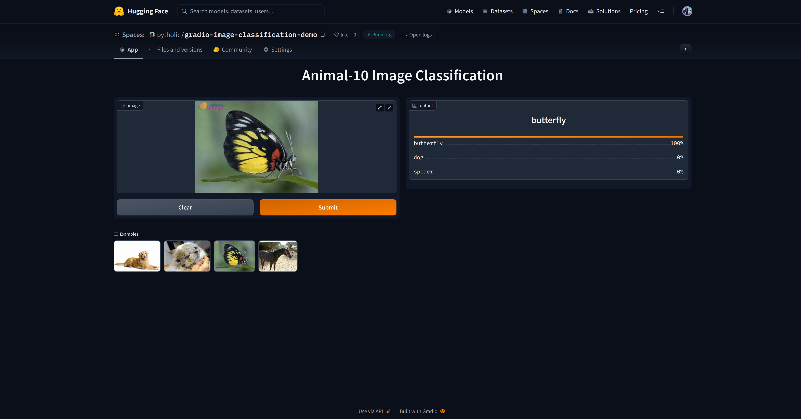

# Overview
The main goal of the project is to build an image classification mode, create app using Gradio and deploy it.

# Requirements
```
pytorch
pytorch-lightning
clearml
rich
tqdm
split-folders
simple-parsing
gradio
```

# Details

## Dataset
I am using <a href="https://www.kaggle.com/datasets/alessiocorrado99/animals10">Animal-10</a> dataset from kaggle. You can split dataset into train, valid, and test folder using <a href="pip install split-folders">split-folders</a>.

## Model
I used various mdoel but the final pipeline is base on ResNet-18 model. You can replace it with the model of your choice if you desire. I did not employ pretrained weights (`weights=None`).

## Training and testing
Training pipeline is defined in `main.py`. There is also a test script `test.py` to run inference and visualize the results.

## Monitor
I used <a href="https://clear.ml/docs/latest/docs/">ClearML</a> to monitor my training process.

<image src="./resources/plots.png">

**Notes:** I did not spend to much time to improve the models metrics. My main focus was to get a decent model and move towards creating the demo application.


# Usage
To run locally:
```
python3 app/app.py
```

# Demo
Check out the live [demo](https://huggingface.co/spaces/pytholic/gradio-image-classification-demo).

<br></br>

